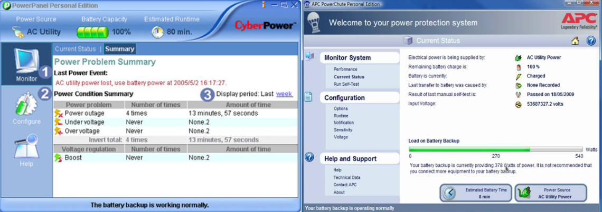

# BatteryWatch
 A backup battery/UPS LAN auto-shutdown utility by Joseph Ryan Ries <ryanries09@gmail.com>

I have several Windows PCs in my house. These PCs are in different rooms of the house, each connected to a separate UPS (uinterruptable power supply) battery backup device. In the event of a prolonged power outage at my house, I would like for all of the PCs in the house to power themselves down gracefully, even if I'm not at home. Most UPS devices come with software that can achieve this, but such software typically has the following drawbacks:

- Such software often comes with poorly designed (in my opinion) graphical interfaces that are stuck in the Windows XP era, e.g.:
  - 
- Such software, because it is based on a graphical user interface, is not configurable via registry or configuration file, meaning that it cannot be deployed or controlled at scale, such as via Group Policy, Configuration Manager, Puppet, etc.
- The software can only interface with that manufacturer's UPS devices, e.g. APC UPSes need APC software, CyberPower UPSes need CyberPower software, etc.
- The software can only control machines where the UPS is directly connected to the machine's USB or serial ports.
- Software may only provide rudimentary or non-configurable features unless you're willing to pay for an upgraded "enterprise" version of the software.

BatteryWatch is a pair of Windows services. The server service is installed on only one machine, and it monitors the battery charge percentage of the connected UPS. Once the battery charge percentage falls below a configurable threshold, the server service sends a UDP broadcast to all devices on the local network segment that it's time to shut down.

On every other machine on the LAN, just the listener service should be installed. The listener listens for the message from the server service and shuts the machine down. So on one machine, both the server and the listener will be installed. On every other machine on the LAN, only the listener will be installed.

The "server" machine should be connected to its UPS including the data cable. The data connection to the UPS is required so that Windows can read the battery charge percentage from the UPS. You should not need to install any of the vendor's UPS software as long as the data cable communicates the current UPS charge level to the operating system. (There should be a battery icon in the Windows notification tray that shows an accurate battery charge reading.) The listener machines do not need data connections to their UPSes. They only need to be on the same LAN/network segment as the server machine.

# Usage

---------------------
`c:\>BatteryWatch.exe`

`BatteryWatch 1.0`

`Server and Listener components for the battery/UPS LAN auto-shutdown utility by Joseph Ryan Ries <ryanries09@gmail.com>`

`Usage:`

`  BatteryWatch -installserver`

`  BatteryWatch -uninstallserver`

`  BatteryWatch -installlistener`

`  BatteryWatch -uninstalllistener`

---------------------

Some example usage:

Both Windows services, the server and the listener, are both embedded within the same executable BatteryWatch.exe. There is no separate installation. This is a portable executble. Just put the executable wherever you want it to live and run the commands to register the server and/or the client. You can install either the server or the listener, or both server and listener on the same machine. Note that only the listener has the ability to actually shut down the machine. The server only monitors the battery and sends shutdown broadcasts.

Both services run as LOCAL SERVICE, which is more secure because the LOCAL SERVICE account has limited privileges and access.

**WARNING:** DO NOT attempt to install the service(s) with the executable at the root of a drive. For example, *do not* install to C:\BatteryWatch.exe or D:\BatteryWatch.exe. The reason why is that the installation procedure will grant the LOCAL SERVICE account access to write to the installation directory because LOCAL SERVICE needs this permission to read and execute the executable, and to write its log files. But you do not want to grant this permission to the root of any drive. So PLEASE install the service(s) in a subfolder. (Any subfolder.)

There are several configurable parameters in the registry. They are located in the User hive of the LOCAL SERVICE account. The S-1-5-19 SID belongs to the LOCAL SERVICE account.

`HKEY_USERS\S-1-5-19\Software\BatteryWatch`

The parameters are:

- **LogLevel**, DWORD, Range 0-3, Default 0: 0 is the least verbose logging level (errors only.) 3 is the most verbose logging level (errors, warnings, info and debug.)
- **ThresholdBatteryPercentage**, DWORD, Range 0-99, Default 50: The percentage of battery charge remaining when the server will broadcast the shutdown signal to the LAN. If you have several UPSes on the LAN that have different battery sizes, you should take that into account when choosing an appropriate threshold battery percentage. For example, during a power outage, a larger UPS (or one with less equipment connected to it) may still be at 60% charge level while another smaller UPS (or one that has more equipment connected to it) has already drained completely.
- **GracePeriodMinutes**, DWORD, Range 0-4294967295, Default 15: The number of minutes that the server service has been running before a shutdown signal can be sent. This is to avoid denial-of-service situations and prevent the service from shutting the system down immediately after it boots up. For example, in the case that the AC power has been restored, but the UPS battery is still charging.
- **BroadcastPort**, DWORD, Range 0-65535, Default 31008: The network port from which the UDP broadcast will originate.
- **Key**, REG_SZ, Range n/a, Default Random: This is 64-character key. The key is randomly generated the first time either the listener or the server starts, if the key does not already exist in the registry. The key must be identical on all machines. The key is sent during the UDP broadcast. If the key sent by the server does not match the key stored on the other machines where the listener service is listening, the shutdown signal will not be honored.
- **DebugShutdown**, DWORD, Range 0-1, Default 0: This registry value only exists in the debug build. It does not exist in the Release build. It is designed to assist in the debugging of the server service by bypassing the battery and grace period thresholds and proceeding directly to the shutdown phase. The registry value is deleted every time it is read and therefore must be "rearmed" every time it is used. This is to avoid denial-of-service situations.

# Logging

The server service logs to the BatteryWatchServer.log file. The listener service logs to the BatteryWatchListener.log file. Both files will reside in the same directory as the BatteryWatch.exe executable. If you want to see more verbose log messages, increase the logging verbosity by setting the LogLevel registry entry as described earlier. Every couple of minutes, the service will check if the current log file has grown to > 512KB, at which point the old log file will be archived and a new one will be started. This is to maintain optimal log file write performance and to make log file archive maintenance easier.

To Do List:

- [ ] Add an IP address filter so that the client will only honor shutdown broadcasts originating from the specified IP address.
- [ ] Create a listener client for Linux.
- [ ] Move to a challenge-response mechanism instead of a preshared key for enhanced security.

